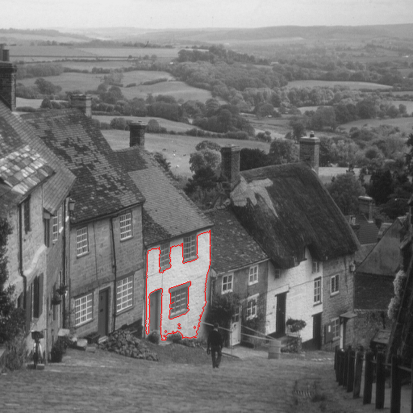

# Incremental component tree contour computation

Dennis J. Silva,  Ronaldo F. Hashimoto, Jiri Kosinka, Jos B.T.M. Roerdink, Wonder A.L. Alves, Alexandre Morimitsu



## Abstract

A component tree is a graph representation that encodes the connected components 
of the upper or lower-level sets of a greyscale image. Consequently, the nodes 
of a component tree represent binary images of the encoded connected components. 
There exist various algorithms that extract information and attributes of nodes of a component tree. We propose an efficient incremental method to compute the contours of the nodes of a component  tree by counting the edges (sides) of contour pixels.

## Experiments

The runtime analysis of the data generated by the source code in this repository is presented in 
this [Google colab](https://colab.research.google.com/drive/18Kyx5M83iL1TQoti4BIih4t4DJyD72Gg?authuser=1).

## 1. Building

The software needs a C++ compiler and [conan v2](https://conan.io/) to build.  It also depends on some Conan packages that can be installed manually using the instruction below.

### 1.1. Manual dependency installation

To install a Conan package, we need to run a Conan command at the root of the repository on the link down below. 

- [morphotree library](https://github.com/dennisjosesilva/morphotree) 

```bash
$ conan create . morphotree/0.0.1@dennisjosesilva/dev
```

### 1.2. Building programs

After the morphotree library is installed, we can compile the programs used to analyse our algorithm.  First, we should create a build directory where we will keep the binary files. To do so, using Linux, we can move to the path where the repository is downloaded as follows:

```bash
cd path/to/repo/
```

Then, we create the build directory by running:

```bash
mkdir build
```

Now, everything is set up to install morphotree as a dependency of our programs. To install the dependencies using conan v2 we can run the following command:

```bash
conan install . --output-folder=build --building=missing
```

It will install the dependencies (morphotree) described in conanfile.txt by generating the cmake setup files in the "build" directory and build the source code if it does not find the binary at the Conan local cache. 

The next step is to compile the programs using CMake. To do this, we go the "build" directory and use CMake to generate the building files as follows:

```bash
cd build 
cmake .. -DCMAKE_TOOLCHAIN_FILE=conan_toolchain.cmake -DCMAKE_BUILD_TYPE=Release
```

By doing so, CMake will generate files that can be compiled by a C++ compiler. We can, generally, compile the source code using the default CMake options running:

```bash
cmake --build .
```

Finally, everything is compiled and ready to run.  After this process, we should have the following programs  (with respectively required parameters) in the build directory:

* **perf_incr_contour  <input_image_path>**: It runs and shows the elapsed time of the incremental contour computation of the max-tree of the "input image" (read from <input_image_path>)  implemeted by morphotree library.

* **perf_incr_contour_hashmap <input_image_path>**: It runs and shows the elapsed time of the incremental contour computation of the max-tree of the "input image" (read from <input_image_path>) implemented using hash maps to store sets.

* **perf_incr_contour_red_black_tree <input_image_path>**: It runs and shows the elapsed time of the incremental contour computation of the max-tree of the "input image" (read from <input_image_path>) implemented using red-black trees to store sets.

* **perf_non_incr_contour <input_image_path>**: It runs and shows the elapsed time of the non-incremental contour computation of the max-tree of the "input image" (read from <input_image_path>).

* **perf_contour_trace <input_image_path>**: It runs an experimental idea of computing contour tracing.

* **check_contour_algorithms <input_image_path> <inTreeAdj= 4|8> <inContourAdj = 4|8>**: It runs the incremental contour computation implemented in morphotree library (the same as the paper) and non-incremental algorithm and compares the results. If the results are not equal it prints the id of the node which they are different, otherwise it prints the results are OK. It performs the algorithms to the max-tree of the input image (read from <input_image_path>), <inTreeAdj> tree connectivity and <inContourAdj> connectivy of the contour.

* **end_slides_image**: It runs the incremental contour computation to compute the contour of a node for the tree of the image "goldhill.pgm" and saves the image "goldhill-highlight.png" highlighting the node contour computed in red. Application used to generate an image for presentation.

### 1.3. Running contour computation bash for all images in our dataset

Inside the "programs" directory, there is a bash which runs the algorithm checking program for all images in "img" (our dataset) for all possible parameter combinations. You can run this batch by running after building the programs (step 1.2):

```bash
bash perfom_check_dataset.sh
```

As the results show our incremental algorithm produces the same result as the non-incremental (brute-force, reconstruction-based approach) for all images in our dataset for all combinations of adjacencies for the max-tree and contour.

# 2. Generating chessboard (checkboard) images

There is a script in Python in "analyse-code" directory which can be used to generate the chessboard images. It requires *numpy* and *imageio* packages. To run, we can just run:

```bash
python gen_checkbox_pattern.py <N> <output_file_name>
```

inside "analyse-code" where <N> defines the NxN number of squares of the output image and <output_file_name> defines the location and filename of the generated image.

# 3. Generating the runtime of the algorithms

The scripts to generate the ".csv" files used for the runtime analysis are available at this [Google Drive folder](https://drive.google.com/drive/u/1/folders/1F8o781tyAaHEVwBRo01fqX4Wz9gK96ay) are available in the "analysis-code" directory. They require morphotreepy library which can be installed following the instruction on its [GitHub page]((https://github.com/dennisjosesilva/morphotreepy), *pandas*, and *imageio* libraries. In this directory, we have the following script to generate the runtime dataset:

* **gen_runtime_2.py -i <input_base_path> -o <output_file_name> -e <rhn|rnh|nhr|nrh|hnr|hrn>**: It generates a csv file describing the runtime experiments of our dataset and save it as <output_file_name>.  The images used for the experiments are located at <input_base_path> directory and the order of the execution of the algorithm is defined by the string followed by **-e** (the string s defined next).
* **gen_runtime_chessboard_csv_2.py -i <input_base_path> -o <output_file_name> -e <rhn|rnh|nhr|nrh|hnr|hrn>**: It generates a csv file describing the runtime experiments of the chessboard images and save it as <output_file_name> . The images used for the experiments are located at <input_base_path> directory and the order of the execution of the algorithm is defined by the string followed by **-e** (the string s defined next).
  
  
  

Both scripts for runtime analysis use a parameter **-e** for defining the order of the execution of the methods. It is a three-character string where the first character defines the first algorithm to be executed, the second character defines the second algorithm to be executed and the third character defines the third algorithm to be executed. The available characters and their associated algorithm are described below:

* **n**: Non-incremental contour computation algorithm. In this approach, each node of the max-tree of the input image is reconstructed and the contour is computed as described by Algorithm 2 from the paper.

* **h**: Incremental contour computation algorithm. In this approach, the contour is computed using the incremental algorithm described in Algorithm 3 from the paper using hash-maps to represent sets.

* **r**: Incremental contour computation algorithm. In this approach, the contour is computed using the incremental algorithm described in Algorithm 3 from the paper using red-black trees to represent sets.

The generated CSV files contain the following columns:

* **Empty column header**: There is an empty column header to represent the index of the experiments. It goes from zero to the number of images - 1.

* **image**: Image filename 

* **width**: Image width

* **height**: Image height

* **npixels**: number of pixels (computed as width $\times$ height) 

* **runtime_contour_rb**: Runtime in milliseconds of the incremental algorithm for contour computation using red-black trees

* **runtime_contour_hm**: Runtime in milliseconds of the incremental algorithm for contour computation using hash-maps

* **runtime_non_incr_contour**: Runtime in milliseconds of the non-incremental algorithm for contour computation.

The repository also contains two bash scripts which reproduce the dataset we reported in the paper and the result are available in [paper-runtime-analysis - Google Drive](https://drive.google.com/drive/u/1/folders/1F8o781tyAaHEVwBRo01fqX4Wz9gK96ay). The scripts **run_gen_runtime_2.sh** and **run_gen_runtime_checkboard_2.sh** runs the scripts **gen_runtime_2.py** and **gen_runtime_checkboard_2.py**, respectively, twice for each available contour computation algorithm order. They generate 12 csv files which were used to perform the time analysis of our algorithm in the paper.
